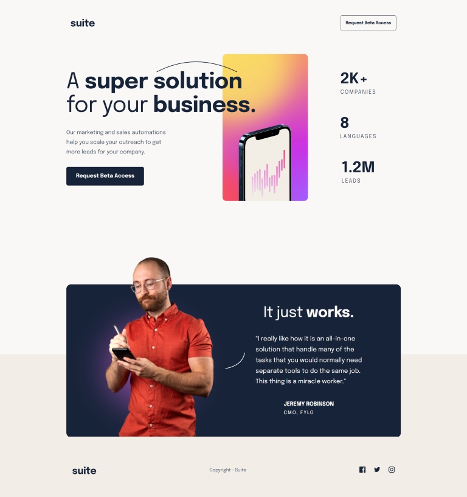

# Frontend Mentor - Suite landing page solution

This is a solution to the [Suite landing page challenge on Frontend Mentor](https://www.frontendmentor.io/challenges/suite-landing-page-tj_eaU-Ra). Frontend Mentor challenges help you improve your coding skills by building realistic projects.

## Table of contents

- [Overview](#overview)
  - [The challenge](#the-challenge)
  - [Screenshot](#screenshot)
  - [Links](#links)
- [My process](#my-process)
  - [Built with](#built-with)
  - [What I learned](#what-i-learned)
  - [Continued development](#continued-development)
- [Author](#author)

## Overview

### The challenge

Users should be able to:

- View the optimal layout depending on their device's screen size
- See hover states for interactive elements

### Screenshot

### Links

- Solution URL: [Solution](https://github.com/socratesioa/suite-landing-page)
- Live Site URL: [Live Site](https://socratesioa.github.io/suite-landing-page)

## My process

### Built with

- Semantic HTML5 markup
- CSS custom properties
- Flexbox
- CSS Grid
- Mobile-first workflow

### What I learned

Good practice of CSS positioning, Grid and Flexbox. Also interesting layout changes.

### Continued development

I need to improve my planning skills. I used a mobile first approach. In some cases I had to go back and alter the HTML code for things to work as I needed them. I could save time with better planning rather than diving in head first.

## Author

- Website - [My Portfolio](https://portfolio.thisissocrates.com)
- Frontend Mentor - [@socratesioa](https://www.frontendmentor.io/profile/socratesioa)
